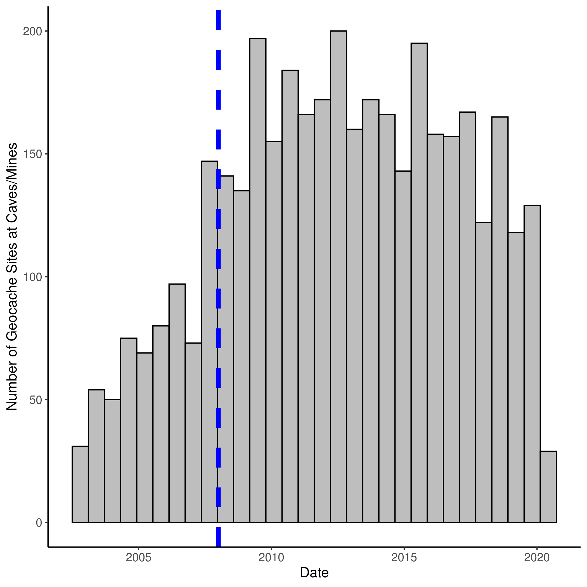

# Pd_Geocache
Search geocaching databases for evidence of people visiting caves!

## TO-DO
- confirm accuracy of geocache locations
	- Mines/Caves are actually in Mines/Caves
- Smarter regex strategy for finding user records with bat sightings
	- i.e. "spotted a bat" vs. "blind as a bat"
- Adjacency matrix at the geocache level, instead of county
	- re-run mantel
	- useful when I get around to integrating new methods

# Pre-requisites
Some packages for spatial operations are needed
- GDAL (for package "rgdal")
	- `sudo apt-get install libgdal1-dev libproj-dev`
- Selenium (for scraping purposes)
	- [install via docker is recommended](https://github.com/SeleniumHQ/docker-selenium)

## General Workflow

### Scraping user records from geocaching.com
- pull user info, visits to a site, date, log entry
	- scrape-geocaches.R
- reverse-lookup of users
	- user_lookup.R
- aggregating records in a usable format
	- showing temporal trends, etc.
	- geocache_mapping.R

### Incorporating spatial information
- Find which geocaching sites overlap with which counties
	- coordinate-overlap.R
- Find closest match to known sites by fuzzing matching of lat/lon
	- coordinate-match.R

### Incorporating WNS incidence records
- Grabbing WNS records
	- wns-presence.R
- raster/shape files of US/Canada counties
	- county-fix.R
- Adjacency matrix
	- spatial-weight-matrix.R

### Statistical tests
- Does the spread of WNS correspond to the levels of human activity?
	- mantel test
	- new methods???
